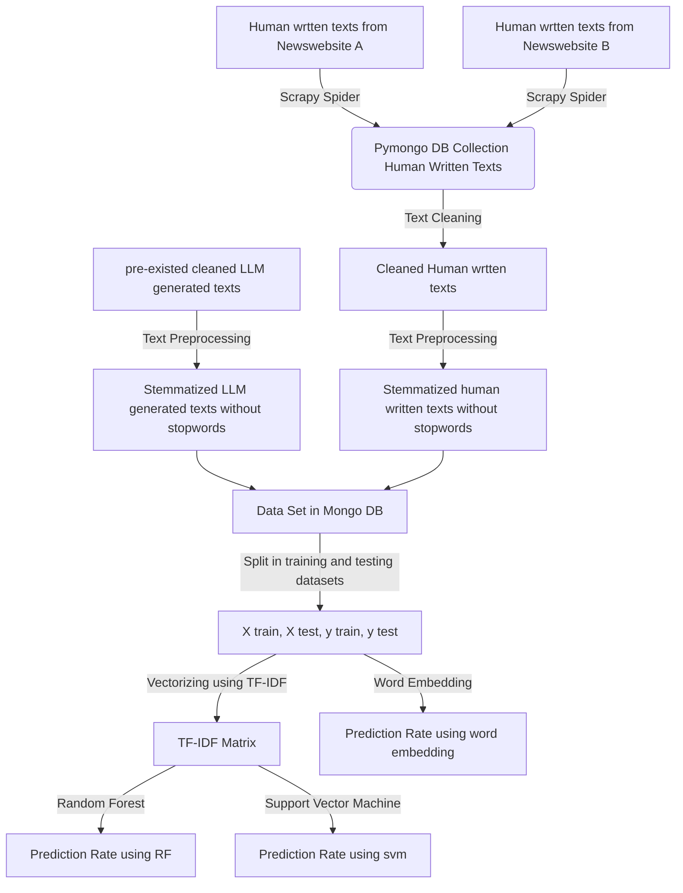

# project-ai-text-detector
A project to do classification for llm generated texts and human written texts in German.
The goal is to compare the results using three different classification models random forest, svm and word embedding.

